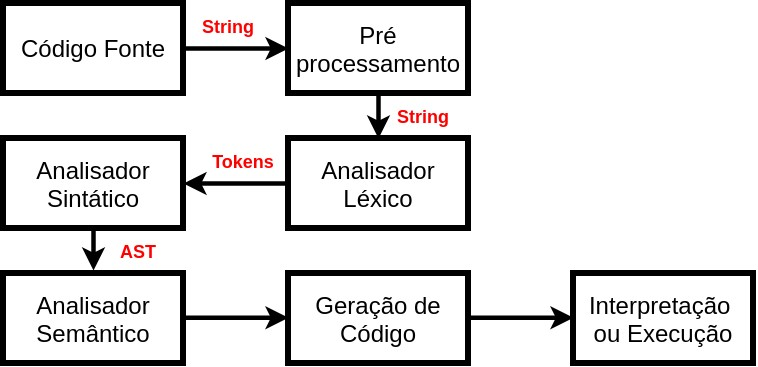
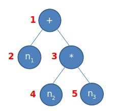

--- 
marp: true
size: 16:9
theme: insper
math: mathjax
---

<!-- _class: first -->

# Disciplina da Disciplina
## Aula &aula
### Professor
#### 2022-2

---

# Esta Aula

* Exemplo de uso do Marp com layout Insper
* Para criar novos stilos ou mudar posições, basta modificar o style acima
* Veja a documentação do Marp para mais detalhes

---

# Figura

---

<!-- _class: double -->

# Como fazer duas colunas?

$$ n_1 + n_2 * n_3 $$

Bla Bla Bla Bla Bla Bla Bla Bla Bla Bla Bla Bla

Exemplo ao lado:

#1: Bla Bla Bla 
#2: Bla Bla Bla
#1: Bla Bla Bla
#3: Bla Bla Bla
#4: Bla Bla Bla
#3: Bla Bla Bla
#4: Bla Bla Bla
#3: Bla Bla Bla
#1: Bla Bla Bla

---

<!-- _class: narrow -->

# Comprime o espaçamento

* Bla Bla Bla Bla Bla Bla Bla Bla Bla Bla Bla Bla
* Bla Bla Bla Bla Bla Bla Bla Bla Bla Bla Bla Bla
* Bla Bla Bla Bla Bla Bla Bla Bla Bla Bla Bla Bla
* Bla Bla Bla Bla Bla Bla Bla Bla Bla Bla Bla Bla
* Bla Bla Bla Bla Bla Bla Bla Bla Bla Bla Bla Bla
* Bla Bla Bla Bla Bla Bla Bla Bla Bla Bla Bla Bla
* Bla Bla Bla Bla Bla Bla Bla Bla Bla Bla Bla Bla
* Bla Bla Bla Bla Bla Bla Bla Bla Bla Bla Bla Bla

---

# Próxima Aula

&proximo -> Veja o main.py para mais detalhes